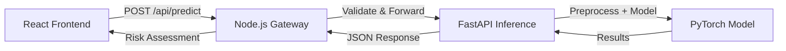

# COVID-19 Cough Signal Analysis

[](https://github.com/your-org/covid-cough-detection/actions/workflows/ci.yml)
[](https://github.com/your-org/covid-cough-detection/releases)
[](LICENSE)

Production-oriented full-stack system for cough-audio COVID-19 risk signal inference.

> ⚠️ **Disclaimer**: This repository is a research/demo system and **not** a medical diagnosis tool. Results should not be used for medical decision-making.

## 🏗 Architecture



**Technology Stack:**
- **Frontend**: React 19 + Vite + TypeScript + Tailwind CSS + Radix UI
- **API Gateway**: Node.js 20 + Express + TypeScript + Rate Limiting
- **Inference Service**: FastAPI + PyTorch + Python 3.10+
- **Deployment**: Docker Compose with health checks

**Runtime Flow:**
1. Browser uploads audio file to `POST /api/predict` on Node gateway
2. Node validates audio contract (format, duration, size) and applies rate limiting
3. Node forwards validated request to Python inference service
4. Python performs preprocessing + model inference and returns label/probability
5. Frontend displays risk assessment with appropriate disclaimers

## 📁 Repository Structure

```
covid-cough-detection/
├── client/                 # React application (Vite + TypeScript)
│   ├── src/
│   │   ├── components/     # Reusable UI components
│   │   ├── pages/          # Page-level components
│   │   ├── lib/            # Utilities, API client, formatters
│   │   └── const.ts        # Application constants
│   ├── public/             # Static assets
│   └── package.json
├── server/                 # Node.js API gateway
│   ├── src/
│   │   ├── index.ts        # Express server entry point
│   │   ├── audio-validator.ts   # Audio validation logic
│   │   ├── audio-converter.ts   # FFmpeg-based conversion
│   │   ├── rate-limiter.ts      # LRU rate limiting
│   │   └── config/version.ts    # Auto-generated version
│   └── package.json
├── python_project/         # FastAPI inference backend
│   ├── src/covid_cough_detection/
│   │   ├── app.py          # FastAPI application
│   │   ├── audio_processor.py   # Audio preprocessing
│   │   ├── model_inference.py   # Model loading & inference
│   │   └── version.py      # Auto-generated version
│   ├── tests/              # Pytest test suite
│   └── pyproject.toml
├── shared/                 # Shared code between packages
│   └── version.ts          # Auto-generated version metadata
├── scripts/                # Build & maintenance scripts
│   ├── sync-version.mjs    # Version synchronization
│   └── check-version-consistency.mjs
├── dataset/                # Sample datasets & tooling (dev only)
├── .github/workflows/      # CI/CD pipelines
├── docker-compose.yml      # Multi-service orchestration
└── Dockerfile.node         # Production Node image with ffmpeg
```

## 🚀 Quick Start

### Prerequisites

- **Node.js**: 20+ (LTS recommended)
- **Python**: 3.10+
- **pnpm**: 10.33.0 (managed via corepack)
- **Docker** (optional, for containerized deployment)

### Local Development

1. **Clone and setup:**
```bash
git clone https://github.com/your-org/covid-cough-detection.git
cd covid-cough-detection
corepack enable
```

2. **Install JavaScript dependencies:**
```bash
corepack pnpm install
```

> 💡 If pnpm reports "ignored build scripts" (e.g., esbuild), run `pnpm approve-builds` and select the listed packages.

3. **Install Python dependencies:**
```bash
cd python_project
pip install -e ".[dev]"
cd ..
```

4. **Start Python inference service:**
```bash
# Set model path (required)
export MODEL_PATH=./models/model.pt  # macOS/Linux
# set MODEL_PATH=./models/model.pt   # Windows

cd python_project
python -m uvicorn covid_cough_detection.app:app --host 0.0.0.0 --port 8000 --reload
```

5. **Start frontend + Node gateway:**
```bash
# From repo root
corepack pnpm dev
```

**Access Points:**
- Frontend: http://localhost:5173
- Node Gateway: http://localhost:3000
- Python Backend: http://localhost:8000

## 🔧 Configuration

### Environment Variables

**Node Gateway (`server/.env`):**
```bash
PYTHON_SERVICE_URL=http://localhost:8000
ALLOWED_ORIGINS=http://localhost:5173
NODE_ENV=development
PORT=3000
RATE_LIMIT_WINDOW_MS=60000
RATE_LIMIT_MAX_REQUESTS=100
```

**Python Service:**
```bash
MODEL_PATH=./models/model.pt
HOST=0.0.0.0
PORT=8000
LOG_LEVEL=info
```

### Model Requirements

The system requires a PyTorch model file at `python_project/models/model.pt`:
- Format: `.pt` (PyTorch checkpoint)
- Input: Preprocessed audio features
- Output: Binary classification (positive/negative) with probability

> ⚠️ **Note**: This repository does not include a trained model. You must provide your own `model.pt` file.

## 📡 API Documentation

### Node Gateway Endpoints

| Method | Endpoint | Description |
|--------|----------|-------------|
| GET | `/api/healthz` | Liveness probe |
| GET | `/api/readyz` | Readiness probe (checks Python service) |
| GET | `/api/health` | Readiness mirror |
| GET | `/api/version` | Current version info |
| POST | `/api/predict` | Audio prediction endpoint |

### Prediction Request

**Endpoint**: `POST /api/predict`

**Content-Type**: `multipart/form-data`

**Form Field**: `audio` (or `file`) - Audio file (WAV, MP3, FLAC, OGG)

**Constraints**:
- Maximum file size: 10MB
- Supported formats: WAV, MP3, FLAC, OGG
- Recommended duration: 1-10 seconds

### Response Formats

**Success Response (200):**
```json
{
  "label": "positive",
  "prob": 0.84,
  "model_version": "1.0.13",
  "processing_time_ms": 123.4
}
```

**Error Response (4xx/5xx):**
```json
{
  "error": "Invalid audio format",
  "details": "Expected WAV, MP3, FLAC, or OGG. Received: audio/x-custom"
}
```

## ✅ Quality Gates

Run all quality checks before committing:

```bash
# TypeScript type checking
corepack pnpm check

# ESLint linting
corepack pnpm lint

# Build verification
corepack pnpm build

# Unit tests (JS + Python)
corepack pnpm test

# Version consistency
corepack pnpm check:version

# Python-specific checks
python -m pytest python_project/tests -q
python -m compileall python_project/src
```

## 🐳 Docker Deployment

### Production Deployment

The Node production image includes **ffmpeg** for audio conversion:

```bash
docker compose up --build
```

**Services:**
- `node-gateway`: http://localhost:3000
- `python-inference`: http://localhost:8000

### Health Checks

- Node gateway: `/api/healthz`, `/api/readyz`
- Python service: `/healthz`, `/readyz`

Compose health checks are model-gated via Python `/readyz` endpoint.

### Volume Mounts

```yaml
volumes:
  - ./python_project/models:/app/models:ro
  - ./python_project/logs:/app/logs
```

## 🔒 Security Considerations

### Production Checklist

- [ ] Set `ALLOWED_ORIGINS` for CORS (Node gateway)
- [ ] Configure rate limiting parameters
- [ ] Enable HTTPS termination (reverse proxy)
- [ ] Set up log aggregation
- [ ] Configure monitoring/alerting
- [ ] Review CSP headers in `server/src/index.ts`
- [ ] Validate model file integrity

### Rate Limiting

Default configuration:
- Window: 60 seconds
- Max requests per IP: 100
- LRU eviction for memory safety

Adjust in `server/src/rate-limiter.ts` or via environment variables.

## 🧪 Testing

### Test Structure

```
client/src/**/*.test.ts(x)   # React component & utility tests
server/src/**/*.test.ts      # API gateway & validation tests
python_project/tests/        # Python inference tests
```

### Running Tests

```bash
# All tests
corepack pnpm test

# Client tests only
corepack pnpm --filter ./client test

# Server tests only
corepack pnpm --filter ./server test

# Python tests
python -m pytest python_project/tests -v
```

### Test Coverage Goals

- Critical paths (validation, conversion): 100%
- API endpoints: 90%+
- UI components: 80%+

## 📊 Version Management

This project uses a monorepo version strategy:

**Source of Truth**: Root `package.json` version field

**Auto-Generated Files**:
- `shared/version.ts`
- `server/src/config/version.ts`
- `python_project/src/covid_cough_detection/version.py`
- `client/package.json`
- `server/package.json`
- `python_project/pyproject.toml`

**After Version Bump**:
```bash
# Update root package.json version
# Then run:
corepack pnpm run sync:version

# Verify consistency
corepack pnpm run check:version
```

## 🤝 Contributing

### Development Workflow

1. Fork the repository
2. Create a feature branch (`git checkout -b feature/amazing-feature`)
3. Make changes with tests
4. Run all quality gates
5. Commit with conventional commits
6. Push and open a Pull Request

### Code Style

- TypeScript: Strict mode enabled
- Formatting: Prettier (auto-applied on commit)
- Linting: ESLint with custom rules
- Python: Black + isort + flake8

## 📄 License

MIT License - see [LICENSE](LICENSE) for details.

## 🙏 Acknowledgments

- Dataset: [CoughVID dataset](https://doi.org/10.5281/zenodo.3831669)
- Framework: FastAPI, Express, React
- ML: PyTorch ecosystem

## 📞 Support

For issues and questions:
- GitHub Issues: [Report a bug](https://github.com/your-org/covid-cough-detection/issues)
- Documentation: See `API_DOCUMENTATION.md`, `DEPLOYMENT_GUIDE.md`, `TESTING_GUIDE.md`

---

**Current Version**: 1.0.13  
**Last Updated**: 2024-04-16  
**Status**: Production-ready (research/demo purposes)
